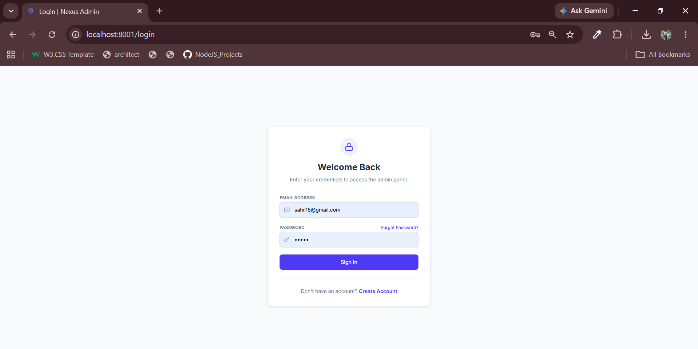
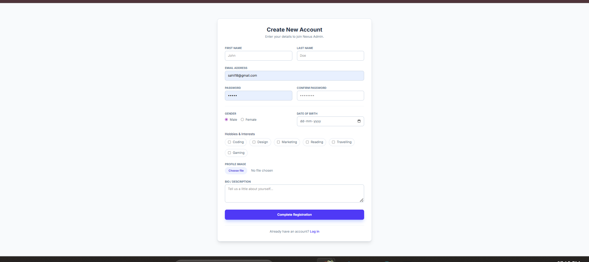
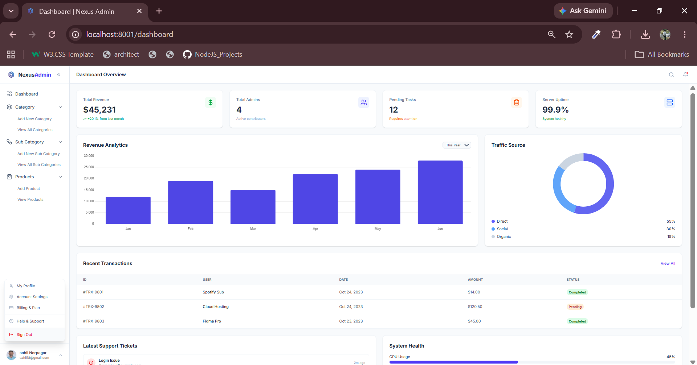
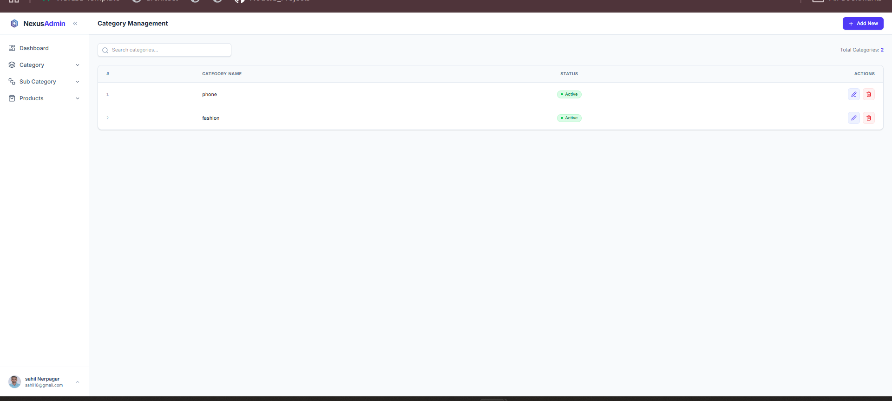
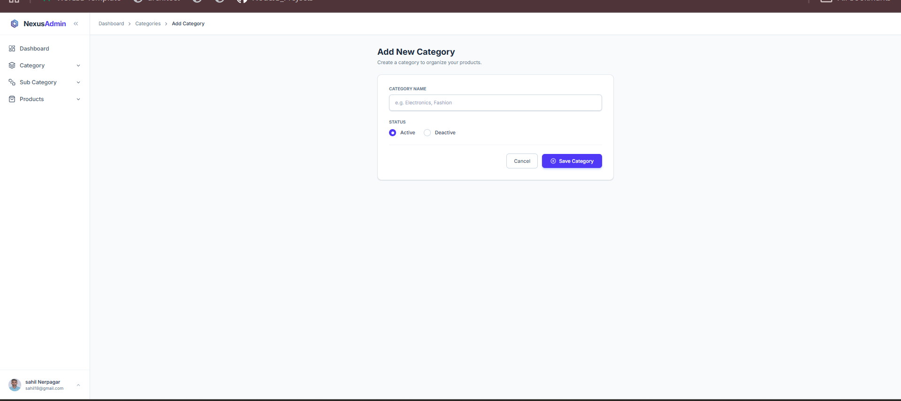
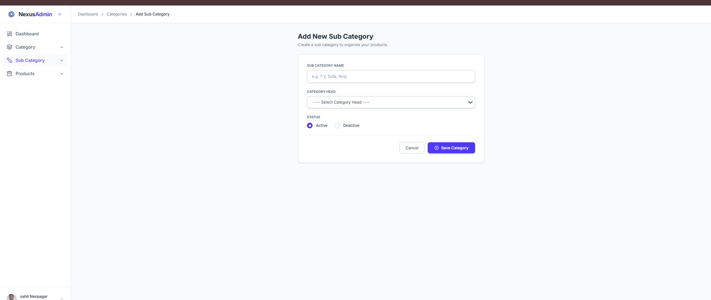
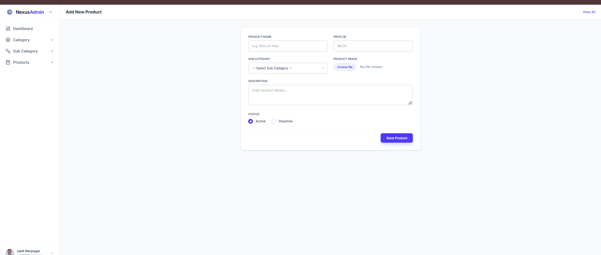
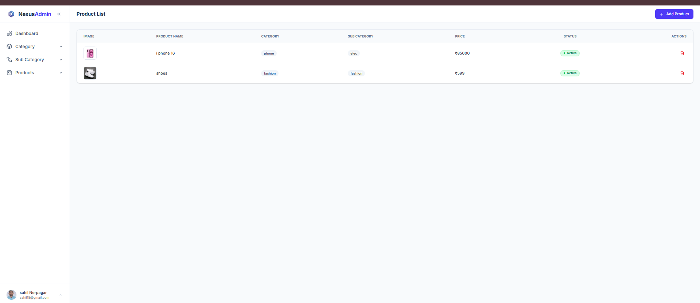
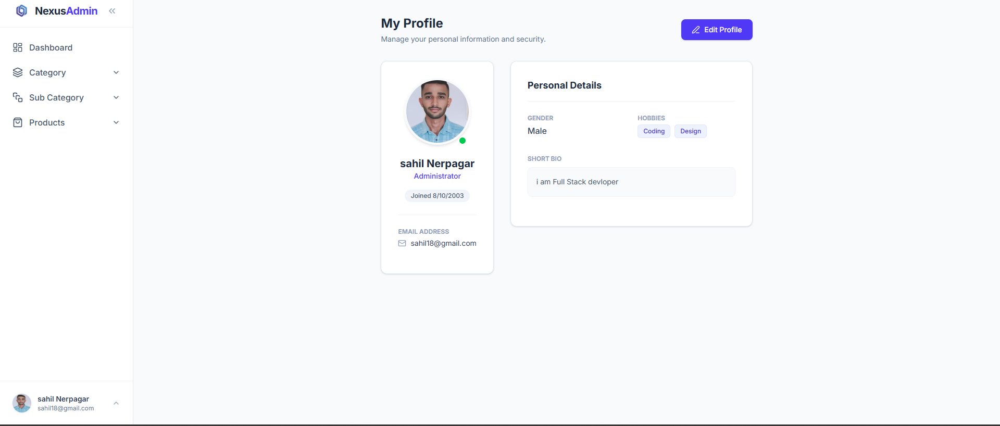
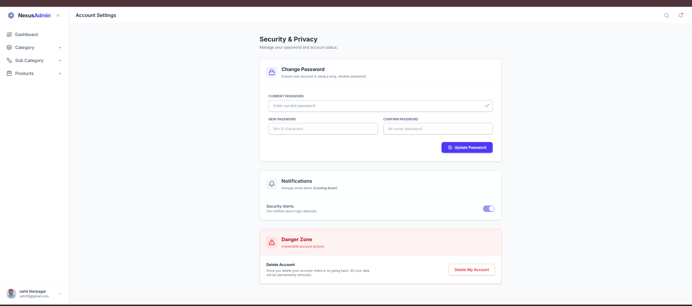

# 🚀 Admin Panel Management System

A modern and responsive **Admin Panel Management System** built with **Node.js, Express.js, MongoDB, EJS, Bootstrap, Multer, and Cookie Parser**.

This application helps administrators manage admin records through an easy-to-use dashboard with image uploads, status management, and database integration.

---

## ✨ Features

- 📊 Professional Dashboard
- ➕ Add Admin
- 📋 View Admin Records
- 🗑️ Delete Admin
- 📸 Upload Admin Profile Image
- 🟢 Active / 🔴 Inactive Status
- 🍪 Cookie-Based Authentication
- 💾 MongoDB Database Integration
- 📱 Responsive Bootstrap UI
- ⚡ Fast and Beginner-Friendly Code Structure

---

## 🛠️ Technologies Used

- Node.js
- Express.js
- MongoDB
- Mongoose
- EJS
- Bootstrap 5
- Multer
- Cookie Parser

---

## 📂 Project Structure

```text
admin-panel/
│
├── config/
│   └── db.js
│
├── models/
│   └── admin.model.js
│
├── routes/
│   └── adminRoutes.js
│
├── views/
│   ├── dashboard.ejs
│   ├── addAdmin.ejs
│   └── viewAdmin.ejs
│
├── public/
│   ├── uploads/
│   └── css/
│
├── app.js
├── package.json
├── vercel.json
└── README.md
```

---

## 👨‍💼 Admin Information Fields

The Add Admin Form includes:

- Name
- Email
- Gender
- Phone Number
- Date of Birth
- City
- Role
- Salary
- Language
- Status
- Profile Image

---

## 🌐 Application URL

```text
http://localhost:8001
```

---

## 🔐 Authentication

- Cookie-Based Login Authentication
- Protected Routes
- Logout Functionality

---

## 🚀 Future Enhancements

- ✏️ Edit Admin
- 🔍 Search Admin
- 📄 Pagination
- 📈 Dashboard Analytics
- 🔐 JWT Authentication
- 👥 Role-Based Access Control
- 🌙 Dark Mode

---

## output

         


## 👨‍💻 Developer

### Sahil Nerpagar

**Full Stack Developer**

Passionate about building scalable web applications using:

- Node.js
- Express.js
- MongoDB
- JavaScript
- Bootstrap
- REST APIs

---

## ⭐ Support

If you found this project helpful, please give it a **Star ⭐** on GitHub.

---

## 📜 License

This project is developed for educational and learning purposes.

---

### Happy Coding 🚀